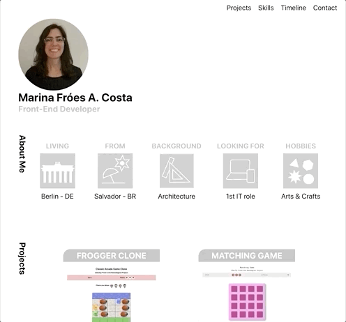

<p align="center"></p>

<h1 align="center">My Portfolio </h1>

## Overview

<p align="center"></p>

## Introduction

- I created this Portfolio web app to use the skills I learned in my React Course and also to show some information about me.

## Installation and use

- Download the files, cd into root directory and run:
```bash
# Install dependencies
$ npm install

# Run the app
$ npm start
```

## References

- This project was bootstrapped with [Create React App](https://github.com/facebook/create-react-app).
- [React documentation](https://reactjs.org/).
- Deployed by following the [Oluwaseun Tutorial](https://medium.com/the-andela-way/how-to-deploy-your-react-application-to-github-pages-in-less-than-5-minutes-8c5f665a2d2a).

